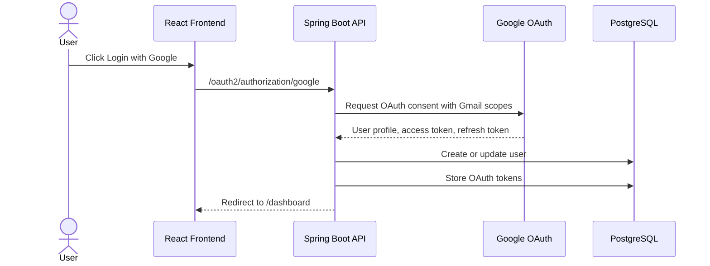
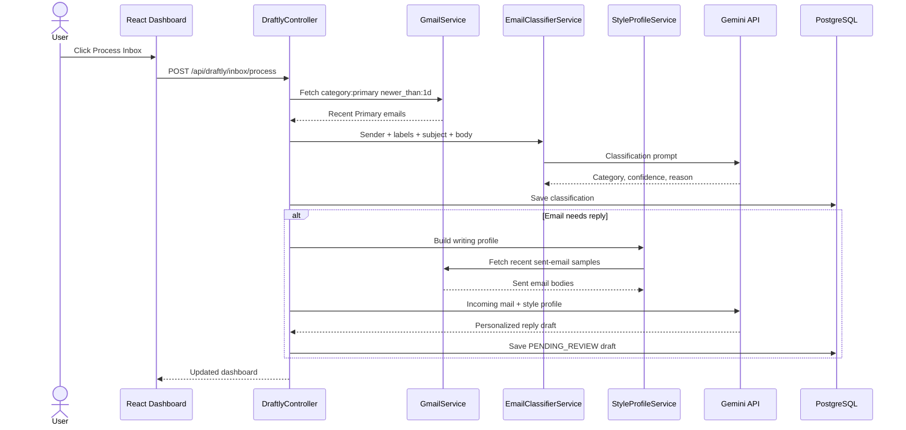
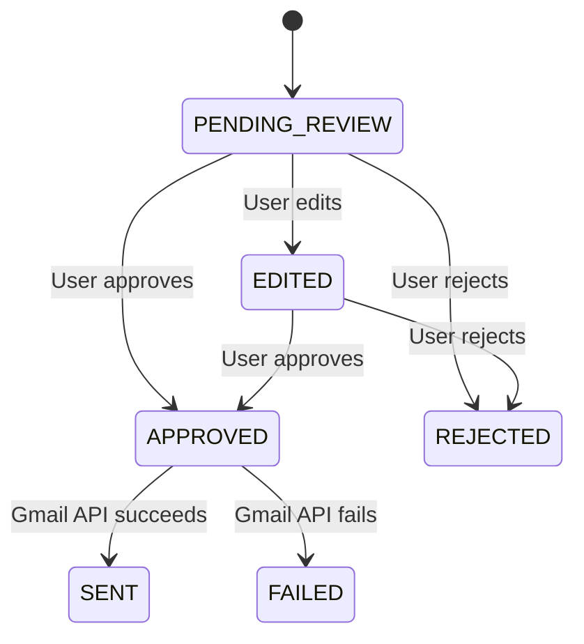

# Draftly: Gmail AI Reply Agent

## Low-Level Design Document

## 1. Purpose

Draftly is a Gmail reply assistant that identifies emails requiring a personal response, skips irrelevant messages, generates reply drafts in the user's usual writing style, and sends replies only after explicit user approval.

## 2. Technology Stack

| Layer | Technology |
| --- | --- |
| Frontend | React, TypeScript, Vite |
| Backend | Java, Spring Boot, Spring Security |
| Database | PostgreSQL |
| Authentication | Google OAuth2 |
| Email Integration | Gmail REST API |
| LLM | Google Gemini API |

## 3. Main Modules

| Module | Responsibility |
| --- | --- |
| `SecurityConfig` | Configures OAuth2 login, CORS, and protected routes |
| `OAuth2LoginSuccessHandler` | Registers users and stores Google access and refresh tokens |
| `GmailService` | Fetches Primary inbox emails, fetches sent-email samples, refreshes tokens, and sends replies |
| `EmailClassifierService` | Uses Gemini to decide whether an email needs a reply; falls back to rules if Gemini fails |
| `StyleProfileService` | Analyzes recent sent emails to infer tone, greeting, sign-off, length, and common phrases |
| `AiDraftService` | Sends incoming email context and style profile to Gemini to generate a personalized draft |
| `DraftlyService` | Orchestrates inbox processing, persistence, review workflow, and sending |
| `DraftlyController` | Exposes REST APIs consumed by the React frontend |

## 4. Package Structure

```text
com.draftly.ai
├── config
│   ├── SecurityConfig
│   ├── GoogleAuthorizationRequestResolver
│   ├── JacksonConfig
│   └── DatabaseMigrationConfig
├── controller
│   ├── AuthController
│   ├── DraftlyController
│   └── ApiExceptionHandler
├── dto
│   ├── DashboardDto
│   ├── EmailSummaryDto
│   ├── EmailMessageDto
│   ├── ReplyDraftDto
│   └── WritingStyleProfile
├── models
│   ├── User
│   ├── OAuthToken
│   ├── EmailMessage
│   └── ReplyDraft
├── repository
│   ├── UserRepository
│   ├── OAuthTokenRepository
│   ├── EmailMessageRepository
│   └── ReplyDraftRepository
└── service
    ├── CurrentUserService
    ├── GmailService
    ├── EmailClassifierService
    ├── StyleProfileService
    ├── AiDraftService
    └── DraftlyService
```

## 5. Database Design

### `users`

| Field | Description |
| --- | --- |
| `id` | Primary key |
| `email` | Google email address |
| `name` | Display name |
| `google_id` | Google account identifier |
| `pictureurl` | Google profile image |
| `provider` | OAuth provider, currently `google` |
| `created_at` | User creation timestamp |
| `updated_at` | Last profile update timestamp |

### `oauth_token`

| Field | Description |
| --- | --- |
| `id` | Primary key |
| `user_id` | Reference to user |
| `provider` | OAuth provider |
| `access_token` | Token used for Gmail API requests |
| `refresh_token` | Token used to obtain a new access token |
| `access_token_expires_at` | Access token expiry timestamp |
| `created_at` | Creation timestamp |
| `updated_at` | Last token update timestamp |

### `email_message`

| Field | Description |
| --- | --- |
| `id` | Primary key |
| `user_id` | Mailbox owner |
| `gmail_message_id` | Gmail message identifier |
| `thread_id` | Gmail thread identifier |
| `label_ids` | Gmail labels used as classification signals |
| `sender` | Sender details |
| `subject` | Email subject |
| `body` | Normalized email content |
| `category` | Classification category |
| `needs_reply` | Whether a response is required |
| `confidence` | Classification confidence |
| `classification_reason` | Explanation for the decision |
| `received_at` | Mail received timestamp |

### `reply_draft`

| Field | Description |
| --- | --- |
| `id` | Primary key |
| `user_id` | Draft owner |
| `email_message_id` | Original incoming email |
| `draft_content` | Generated or edited reply |
| `status` | Review workflow state |
| `created_at` | Creation timestamp |
| `updated_at` | Last modification timestamp |

## 6. Enums

### Email Categories

```text
NEEDS_REPLY
PROMOTIONAL
NEWSLETTER
OTP_SECURITY
NO_REPLY_REQUIRED
SPAM
```

### Draft Statuses

```text
PENDING_REVIEW
EDITED
APPROVED
REJECTED
SENT
FAILED
```

## 7. API Design

| Method | Endpoint | Purpose |
| --- | --- | --- |
| `GET` | `/api/auth/me` | Returns logged-in Google user |
| `GET` | `/api/draftly/dashboard` | Returns mailbox summaries, counts, and draft summaries |
| `POST` | `/api/draftly/inbox/process` | Fetches and processes recent Primary emails |
| `GET` | `/api/draftly/emails/{id}` | Returns full content for one stored email |
| `PATCH` | `/api/draftly/drafts/{id}` | Saves user edits to a draft |
| `POST` | `/api/draftly/drafts/{id}/approve` | Approves a draft |
| `POST` | `/api/draftly/drafts/{id}/reject` | Rejects a draft |
| `POST` | `/api/draftly/drafts/{id}/send` | Sends an approved reply through Gmail |

## 8. Authentication Flow



## 9. Inbox Processing Flow



## 10. Classification Logic

Classification uses two layers:

1. **Gemini-first decision**
   - Input: sender, Gmail labels, subject, and message body.
   - Output: category, `needsReply`, confidence, and reason.
   - It detects direct, formal, and casual requests such as availability checks, meeting invitations, interview messages, or requests for input.

2. **Rule-based fallback**
   - Used if Gemini is unavailable or the key is missing.
   - Detects OTPs, newsletters, promotions, no-reply senders, and common response patterns.

This avoids incorrectly skipping meaningful messages from companies, recruiters, or individuals.

## 11. Style-Aware Draft Generation

The system fetches recent sent emails and extracts:

```text
tone
greeting style
sign-off style
average reply length
common phrases
preferred writing rules
phrases to avoid
```

The draft-generation prompt includes:

```text
incoming email
sender and subject
user writing-style profile
rules against inventing facts
instruction to return only reply body
```

The MVP uses prompt-based personalization instead of model fine-tuning.

## 12. Draft Lifecycle



Only `APPROVED` drafts can be sent.

## 13. Frontend Views

The React dashboard contains:

| View | Purpose |
| --- | --- |
| `Fetched` | All processed Primary emails |
| `Needs Reply` | Emails classified as requiring a response |
| `Skipped` | Emails ignored by the classifier |
| `Drafts` | Drafts waiting for edit, approval, rejection, or sending |
| `Sent` | Replies successfully sent through Draftly |

Clicking an email opens a separate detail page using:

```text
GET /api/draftly/emails/{id}
```

## 14. Error Handling

The backend returns structured errors:

```json
{
  "error": "Bad Gateway",
  "message": "Gemini request failed: 429 ...",
  "path": "/api/draftly/inbox/process",
  "timestamp": "..."
}
```

The frontend displays the returned error message. If Gemini classification fails, rule-based fallback continues processing and the fallback reason is stored.

## 15. Security Considerations

- OAuth tokens must be encrypted before production use.
- API keys must be supplied through environment variables.
- Gmail replies require explicit user approval.
- Every email/draft query is scoped to the authenticated user.
- Google OAuth scopes should remain limited to required Gmail operations.

## 16. Future Improvements

- Encrypt OAuth tokens at rest.
- Cache style profiles instead of rebuilding them for every generated draft.
- Add Gmail push notifications for realtime processing.
- Use background queues for large inboxes.
- Add audit logs and retry handling for failed sends.
- Add pagination and search for dashboard mail tabs.
- Add tests for classifier edge cases and draft status transitions.
